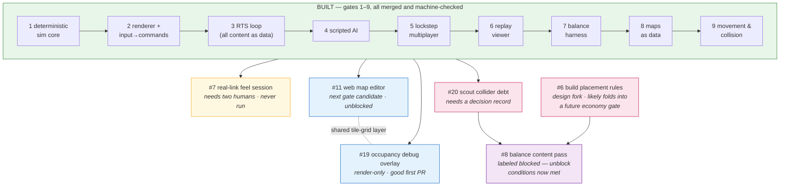

# Roadmap — where this is and where it's pointed

> **Snapshot dated 2026-07-05.** The live forward queue is [the open GitHub issues](https://github.com/colin-prologue/rts-proto/issues)
> (labels `roadmap`, `gate-candidate`, `design-debt`, `blocked`) — that is the source of truth,
> per `CLAUDE.md`. This page is a periodically refreshed *map* of that queue, not a second copy
> of it: when they disagree, the issues win.

## The picture

## What's built (the spine)

Nine gates, each with mechanical acceptance criteria that still run on every PR
(`npm run gates:all` → `ALL GATES PASS`). In order: a deterministic fixed-point sim core with
seeded RNG and golden-hash anchoring; a PixiJS renderer that only reads and interpolates;
the full RTS loop (economy, production, supply, combat) with every stat as a data row; a
rule-based AI issuing commands through the human interface; lockstep multiplayer (relay as
metronome + collator, commands-only wire, checksum desync detection); a replay viewer with
damage flybys, queue pips, and tick-stepping; a headless balance harness (seeded setup jitter,
1000-run win rates, per-run replay export); maps as diffable ASCII fixtures with terrain that
reaches both instruments; and real movement — flow fields, one-unit-per-tile collision, and the
movement-order fairness fix. Details and the human-review item for each: `docs/build-plan.md`.

## The open queue, in plain language

| Issue | What | State |
|---|---|---|
| [#19](https://github.com/colin-prologue/rts-proto/issues/19) | Viewer overlay highlighting any tile holding ≥2 units — makes Gate 9's collision guarantee visible by eye | Ready; render-only, no goldens. **Best first PR for a newcomer.** |
| [#7](https://github.com/colin-prologue/rts-proto/issues/7) | Two-person play session over a real link — judge command-ack feel, whether delay=2 @ 10 Hz holds up | Ready; has been waiting on a second human since Gate 5. |
| [#20](https://github.com/colin-prologue/rts-proto/issues/20) | Design debt: every balance world contains player 0's scout as a stationary collider — a thumb on the map-fairness readout | Needs a decision record choosing among three named forks; moves goldens once, deliberately. |
| [#11](https://github.com/colin-prologue/rts-proto/issues/11) | Web map editor in the playground — paint tiles visually, save the same diffable fixture format | Unblocked gate candidate; full scope sketch on the issue. The next numbered gate. |
| [#6](https://github.com/colin-prologue/rts-proto/issues/6) | BUILD command currently sites buildings anywhere, instantly — placement rules are a real design-identity fork (worker-builds vs C&C-style) | Parked; likely folds into a future economy-depth gate. |
| [#8](https://github.com/colin-prologue/rts-proto/issues/8) | The actual balance content pass — tune unit rows against real mechanics | Labeled `blocked`, but its stated unblock conditions (terrain ✓, movement/collision ✓, side-bias fix ✓) **are now met** — see note below. |

## Where it's pointed

The charter names three design questions: *do these units feel right, do build orders create
interesting decisions, does this map play fair.* The spine and instruments to answer them now
exist. The arc from here:

1. **Trust the instruments** — #19 (see collision legality), #20 (remove the scout's thumb from
   the fairness number), #7 (confirm the multiplayer feel the whole lockstep design promised).
2. **Author content without reading code** — #11, the map editor, turning "does this map play
   fair" into a paint-test-watch loop.
3. **Do the actual design work** — #8, the balance pass, plus the deferred mechanics forks (#6
   build placement, high-ground combat) as they earn gates.

Past that horizon sits the premise's fork (see the README): once the design questions have
answers, this codebase either **evolves into the full product** or the findings — decision
records, the constitution, measured balance numbers — are **exported as the plan for a
ground-up build**. Nothing on this roadmap is graphics polish, and that's deliberate: the
prototype stays ugly but legible until one of those two exits is taken.

Two maintenance notes from the 2026-07-05 audit:

- **#8's `blocked` label is stale on its own terms**: the issue says it unblocks when
  maps/terrain and movement/collision merge and #4 is resolved — all three happened with Gate 9.
  Practically, resolving #20 first keeps the first real balance numbers honest, so the sensible
  order is #20 → #8. Re-label or re-scope on the issue, not here.
- Gates 6–9's human-review items (replay legibility, believable balance numbers, choke-fight
  feel) are one-time judgment calls — a fresh pair of eyes on them is exactly what a new
  collaborator is for.
